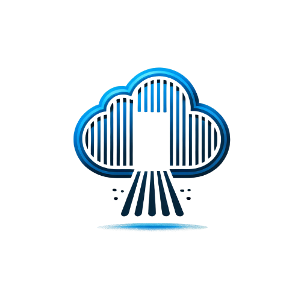

    
    <h1>Cloud-Freedom</h1>

## 🚀 Welcome to Cloud Freedom
Your ultimate guide to building your private cloud storage system and breaking free from monthly subscription fees.

> 💡 *Empowering you to own your data, save money, and enjoy scalable, secure, and accessible cloud storage.*

---

## 📚 What This Guide Covers

This guide includes detailed, step-by-step instructions for:

- Setting up your private cloud storage.
- Configuring and securing your system.
- Integrating your storage with mobile devices.
- Managing multiple users and troubleshooting common issues.

---
## 🛠️ How to Use This Guide

1. Start with the **[Introduction](introduction.md)**.
2. Follow the **[Setup Guide](setup.md)** to install your cloud storage system.
3. Configure and secure your system using the **[Configuration](configuration.md)** and **[Security Best Practices](security.md)** guides.
4. Explore advanced options like **[Mobile App Integration](mobile-app-integration.md)** and **[Multi-User Setup](multi-user-setup.md)**.

## 📍 Roadmap of the Guide

This guide will walk you through the following steps to set up your personal cloud storage system:

1. [**Introduction**](introduction): Why DIY cloud storage is a game changer.
2. [**Setup Guide**](setup): Step-by-step instructions for installation.
3. [**Configuration**](configuration): Customize your cloud for seamless use.
4. [**Security Best Practices**](security): Protect your data with SSL and authentication.
5. [**Multi-User Setup**](multi-user-setup): Learn how to set up your cloud for multiple users with shared access.
6. [**How to Use**](how-to-use): Daily tips for managing and optimizing your cloud storage.
7. [**Troubleshooting**](troubleshooting): Quick solutions to common issues.

---

## 🌟 Why Cloud Freedom?

✅ **Save Money**: No more monthly fees for iCloud or Google Drive.  
🔒 **Complete Control**: Keep your data secure without third-party services.  
🌐 **Accessible Anywhere**: Sync files across devices seamlessly.  
📈 **Scalable**: Expand your storage as your needs grow.

---

## 🌐 Visual Roadmap

> Coming Soon: **Screenshots and diagrams** to make every step of the process clear and beginner-friendly. Stay tuned for updates!

---

## 📢 Stay Updated

Follow us for updates:  
📸 [Instagram](https://instagram.com/cloudfreedom.tech)  
🎥 [TikTok](https://tiktok.com/@cloudfreedom.tech)  
📺 [YouTube](https://youtube.com/channel/CloudFreedom_Tech)

---

## 📝 License

This guide is licensed under the [MIT License](LICENSE).

---

*Let’s build your cloud together! Start your journey [here](introduction.md).*
