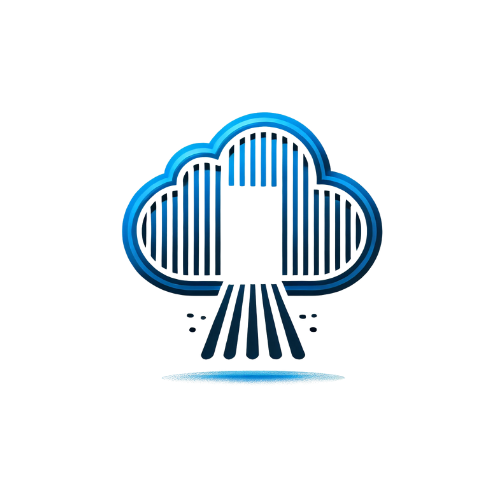

<link rel="apple-touch-icon" sizes="180x180" href="assets/icons/apple-touch-icon.png">
<link rel="icon" type="image/png" sizes="32x32" href="assets/icons/favicon-32x32.png">
<link rel="icon" type="image/png" sizes="16x16" href="assets/icons/favicon-16x16.png">
<link rel="manifest" href="assets/icons/site.webmanifest">
<link rel="shortcut icon" href="assets/icons/favicon.ico">

<h1 style="text-align: center; color: #007BFF;">Your Data, Your Rules</h1>

Welcome to Cloud Freedom, where we empower you to take full control of your data.  
No more monthly fees. No more third-party snooping. With our easy-to-follow guides, you’ll build a private cloud storage system that’s secure, cost-effective, and entirely yours.

---

## 🌐 Why Choose?

- 💰 **Save Money**: Say goodbye to endless subscription fees from major providers.  
- 🔒 **Full Privacy**: Keep your data private—no prying eyes, no third-party access.  
- ⚙️ **Total Control**: Customize your storage your way, on your own terms.

---

## 📚 Explore the Guide:

### **Basic**
Start with the essential steps to build your private cloud:
- [Introduction](introduction.md)
- [Setup](setup.md)
- [Configuration](configuration.md)

---

### **Premium**
Take your private cloud to the next level with advanced features:
- [Multi-User Setup](multi-user-setup.md)
- [Security Best Practices](security.md)
- [How to Use Your Private Cloud](how-to-use.md)

---

### 💡 [Why Use Your Own Private Cloud?](why-use-your-own-cloud.md)  
Explore the benefits of private cloud storage.

---

## 🚀 Take the Next Step:

- [Buy Basic](#)  
- [Buy Premium](#)  

📷 **Placeholder for Visual**  
Add an image symbolizing freedom and security, such as a padlock over a cloud or a private server setup.

---

### 🛠️ [Troubleshooting](troubleshooting.md)  
Resolve common issues and keep your private cloud running smoothly.

---

Don’t wait—**join the Cloud Freedom movement today** and take charge of your digital future.
