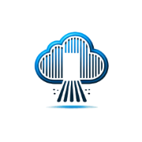

  <h1>🌩️ Cloud Freedom 🌩️</h1>
  
Your Data, Your Rules

  

---

## Welcome to Cloud Freedom

Welcome to **Cloud Freedom**, where we empower you to take full control of your data.  
No more monthly fees. No more third-party snooping. With our easy-to-follow guide, you'll build a private cloud storage system that's secure, cost-effective, and entirely yours. 🌟

---

  <h2>🌍 Why Choose Cloud Freedom? 🌍</h2>

- 💰 **Save Money**: Say goodbye to endless subscription fees from major providers.  
- 🔒 **Full Privacy**: Keep your data private—no prying eyes, no third-party access.  
- ⚙️ **Total Control**: Customize your storage your way, on your own terms.  

---

  <h2>⚡ Quick Start: Hardware Setup ⚡</h2>

Here’s how easy it is to get started with **Cloud Freedom**:  

1. **🛠 Choose Your Hardware**:  
   - Use a Raspberry Pi (budget-friendly) or repurpose an old computer.  
   - **Recommended Specs**: 2GB RAM, 64GB+ storage (expandable).  

2. **📦 Install Your Operating System**:  
   - Download and install a Linux-based OS (e.g., Ubuntu Server) as the backbone for your cloud.  

3. **🌐 Prepare Your Network**:  
   - Assign a **static IP** to your hardware for consistent and reliable access.  

---

  <h2>🔒 Secure Your Cloud (Teaser)</h2>

We take privacy seriously! Here's a sneak peek into one security tip you’ll learn:  

- **💻 Enable SSL Encryption**:  
   - Protect your data in transit with HTTPS using a free SSL certificate from **Let’s Encrypt**.  
   - This ensures your files are safe from hackers when accessing them remotely.  

✨ *For the complete security guide, grab the Premium Guide!* ✨

---

  <h2>📋 Frequently Asked Questions</h2>

**1. What is Cloud Freedom?**  
Cloud Freedom is your guide to setting up your own private cloud storage system, saving you money and keeping your data secure.  

**2. What equipment do I need?**  
A Raspberry Pi or any old computer with at least 2GB of RAM and 64GB+ storage.  

**3. Do I need technical skills?**  
Not at all! Our guide is designed for beginners with easy-to-follow steps.  

---

  <h2>🌟 Testimonials</h2>

> "Cloud Freedom saved me hundreds of dollars in cloud storage fees! The guide was super easy to follow." – *Alex T.*  

> "Finally, I can keep my data private without relying on third-party services." – *Jamie R.*  

---

  <h2>📧 Get in Touch</h2>

Have questions? Reach out to us at **support@cloudfreedom.com**.

---

  <h2>🚀 Take the Next Step 🚀</h2>
  
Get the <strong>Premium Guide</strong> for:

  <ul align="left" style="list-style: none; padding-left: 0;">
    <li>📚 Detailed instructions for every step</li>
    <li>🔐 Advanced security configurations</li>
    <li>🛠 Lifetime updates and expert support</li>
  </ul>
  <a href="#buy-premium-guide" style="background-color: #007BFF; color: white; padding: 10px 20px; text-decoration: none; border-radius: 5px;">Buy Premium Guide</a>

